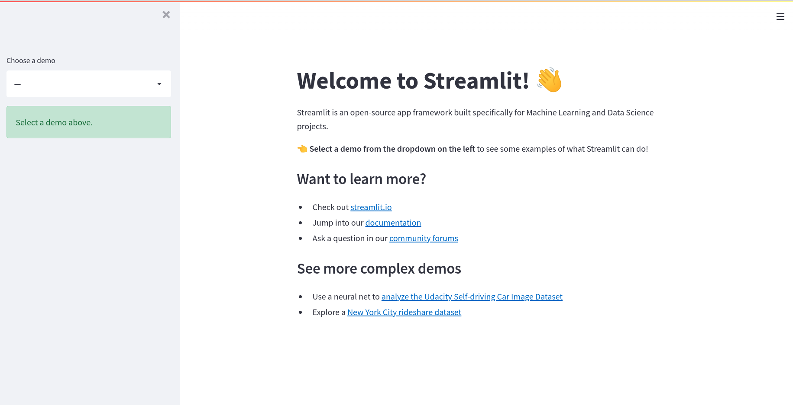

# 30DaysOfStreamlit

# Day 1

- 1 Instalar conda
https://docs.conda.io/en/latest/miniconda.html 

- 2 Crear environment

~~~
conda create -n stenv python=3.9
~~~
- 3 Activar el environment

~~~
conda activate stenv
~~~
- 4 Instalar la librería Streamlit 

~~~
pip install streamlit
~~~
- 5 Ejecutar:

~~~
streamlit hello
~~~

# Day 2
- Escribir las siguientes línea de código 
~~~python
import streamlit as st

st.write('Hello world!')
~~~
- Ejecutar:
~~~
streamlit run streamlit_app.py
~~~

# Day 3
- st.button
~~~python
import streamlit as st

st.header('My first button')

if st.button('Say hello'):
     st.write('Why hello there')
else:
     st.write('Goodbye')
~~~

#  Day 4
- Construir app con Ken Jee

https://www.youtube.com/watch?v=Yk-unX4KnV4
~~~
pip install plotly      
~~~

- Dataset
https://www.kaggle.com/datasets/kenjee/ken-jee-youtube-data
- Cargamos los dataset y los retocamos
~~~python
def load_data():

     """ Loads in 4 dataframes and does light feature engineering"""
     df_agg = pd.read_csv('./data/Aggregated_Metrics_By_Video.csv').iloc[1:,:]
     df_agg.columns = ['Video','Video title','Video publish time','Comments added','Shares','Dislikes','Likes',
                         'Subscribers lost','Subscribers gained','RPM(USD)','CPM(USD)','Average % viewed','Average view duration',
                         'Views','Watch time (hours)','Subscribers','Your estimated revenue (USD)','Impressions','Impressions ctr(%)']
     df_agg['Video publish time'] = pd.to_datetime(df_agg['Video publish time'])
     df_agg['Average view duration'] = df_agg['Average view duration'].apply(lambda x: datetime.strptime(x,'%H:%M:%S'))
     df_agg['Avg_duration_sec'] = df_agg['Average view duration'].apply(lambda x: x.second + x.minute*60 + x.hour*3600)
     df_agg['Engagement_ratio'] =  (df_agg['Comments added'] + df_agg['Shares'] +df_agg['Dislikes'] + df_agg['Likes']) /df_agg.Views
     df_agg['Views / sub gained'] = df_agg['Views'] / df_agg['Subscribers gained']
     df_agg.sort_values('Video publish time', ascending = False, inplace = True)    
     df_agg_sub = pd.read_csv('./data/Aggregated_Metrics_By_Country_And_Subscriber_Status.csv')
     df_comments = pd.read_csv('./data/Aggregated_Metrics_By_Video.csv')
     df_time = pd.read_csv('./data/Video_Performance_Over_Time.csv')
     df_time['Date'] = pd.to_datetime(df_time['Date'])
     return df_agg, df_agg_sub, df_comments, df_time 
~~~
- Creamos un menú lateral y probamos que el menú funciona
~~~python
add_sidebar = st.sidebar.selectbox('Aggregate or Individual Video', ('Aggregate Metrics','Individual Video Analysis'))
if add_sidebar == 'Aggregate Metrics':
     st.write('Agg')
if add_sidebar == 'Individual Video Analysis':
     st.write('Ind')
~~~
- Creamos las metricas para cada menú
~~~python
if add_sidebar == 'Aggregate Metrics':
     st.write("Patricia Aggregated Data")
     df_agg_metrics = df_agg[['Video publish time','Views','Likes','Subscribers','Shares','Comments added','RPM(USD)','Average % viewed',
                             'Avg_duration_sec', 'Engagement_ratio','Views / sub gained']]
     metric_date_6mo = df_agg_metrics['Video publish time'].max() - pd.DateOffset(months =6)
     metric_date_12mo = df_agg_metrics['Video publish time'].max() - pd.DateOffset(months =12)
     metric_medians6mo = df_agg_metrics[df_agg_metrics['Video publish time'] >= metric_date_6mo].median()
     metric_medians12mo = df_agg_metrics[df_agg_metrics['Video publish time'] >= metric_date_12mo].median()
~~~
- Visualizamos la primera métrica
~~~python
    st.metric('Views',metric_medians6mo['Views'],500)
~~~
- Organizamos en columnas las métricas
~~~
    col1, col2, col3, col4, col5 = st.columns(5)
     columns = [col1, col2, col3, col4, col5]
 count = 0
    for i in metric_medians6mo.index:
        with columns[count]:
            delta = (metric_medians6mo[i] - metric_medians12mo[i])/metric_medians12mo[i]
            st.metric(label= i, value = round(metric_medians6mo[i],1), delta = "{:.2%}".format(delta))
            count += 1
            if count >= 5:
                count = 0
~~~
- Crear la tabla
~~~python
 #get date information / trim to relevant data 
    df_agg_diff['Publish_date'] = df_agg_diff['Video publish time'].apply(lambda x: x.date())
    df_agg_diff_final = df_agg_diff.loc[:,['Video title','Publish_date','Views','Likes','Subscribers','Shares','Comments added','RPM(USD)','Average % viewed',
                             'Avg_duration_sec', 'Engagement_ratio','Views / sub gained']]
~~~